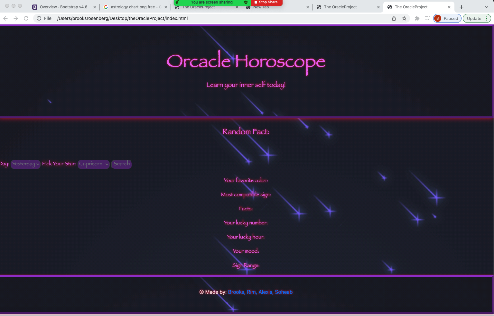

# The Oracle Project

## Description
This is a horoscope application that allows users to check their horoscope, and what is compatible with their particular sign for that particular day. This application also displays a randomly generated fact of the day.

## Screenshot of Application

This is our rendition of a Horoscope generator application that provides users with their horoscope based off their zodiac sign and provides a random fact of the day.

## Table of Contents
- [Description](#Description)
- [Deployment](#Deployment)
- [Usage](#Usage)
- [Contributors](#Contributors)

## Deployment

The application is displayed with GitHub pages: [here](https://brooksrosenberg.github.io/theOracleProject/)

## Usage

When the user accesses the application, they have to choose amongst three days of the week to get their horoscope. 
They also have to provide their zodiac sign. After getting these two information, the application will provide different facts related to the sign and a random fact as well.

## Contributors

These are the people who contributed to the project with their GitHub accounts linked to their names: 

- [Brooks Rosenberg](https://github.com/brooksrosenberg)
- [Rim Zoungrana](https://github.com/Shalah)
- [Alexis Georgiades](https://github.com/AlexisGeorgiades)
- [Soheab Khan](https://github.com/skhangns)
